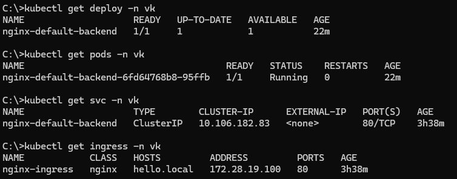

# Разворачивание веб-приложения в Kubernetes


## Описание задачи
```text
Разворачивание веб-приложения в kubernetes, состоящее из 2-х компонентов:
- Ingress Nginx в качестве контроллера для маршрутизации внешнего трафика.
- Простой бэкенд на основе nginx-default-backend, который возвращает страницу index.html с текстом "Hello, Kubernetes!".
Приложение должно быть доступно извне кластера через Ingress.
```

## Namespace
Все действия будем выполнять в namespace "vk", для этого создадим namespace
```bash
kubectl create namespace vk
```

## Для разворачивания веб-приложения будем создавать следующие объекты:
### 1. ConfigMap
Создадим ConfigMap, содержащий файл index.html с текстом "Hello, Kubernetes!".
```bash
kubectl apply -f configmap.yaml
```
### 2. Deployment
Создадим Deployment для nginx-default-backend с 1 репликой (используем образ nginx).
```bash
kubectl apply -f deployment.yaml
```
### 3. Service
Создадим Service типа ClusterIP для nginx-default-backend.
```bash
kubectl apply -f service.yaml
```
### 4. Установка Ingress Nginx контроллера (если не установлен)
- для minikube
```bash
minikube addons enable ingress
```

- для kubernetes cluster
```bash
helm repo add ingress-nginx https://kubernetes.github.io/ingress-nginx
helm repo update
helm install ingress-nginx ingress-nginx/ingress-nginx
```
### 5. Ingress
Создадим Ingress для маршрутизации запросов на бэкенд по хосту `hello.local`.
```bash
kubectl apply -f ingress.yaml
```
- добавим DNS-запись `minikube ip` -> `172.28.19.100 hello.local` в `C:\Windows\System32\drivers\etc`

## Проверка, что все поды запущены и работают:
```bash
kubectl get deploy -n vk
kubectl get pods -n vk
kubectl get svc -n vk
kubectl get ingress -n vk
```


## Проверка работоспособности и логи
`<link>` : <http://ip-address>


`<link>` : <http://hello.local>

- в логах можно увидеть сообщения с кодом `200` и `304`, говорящие об успешности запроса
```bash
kubectl logs nginx-default-backend-6fd64768b8-95ffb -n vk
```

