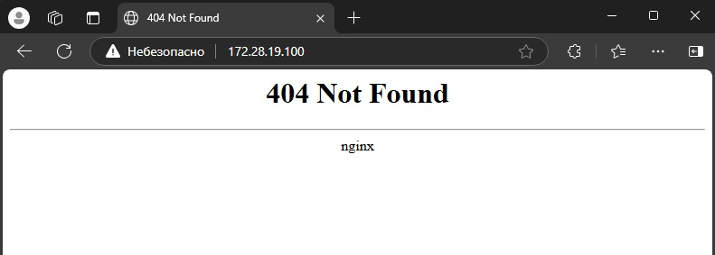
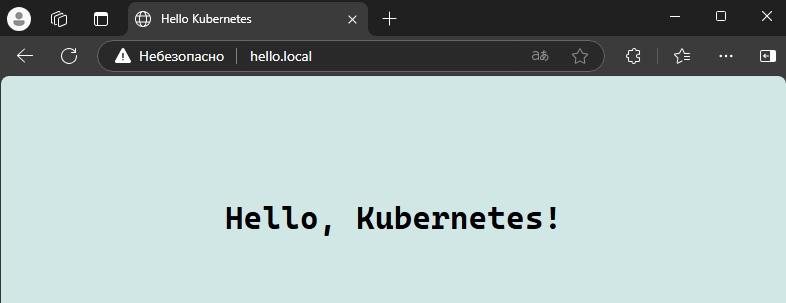

#Разворачивание веб-приложения в Kubernetes


## Описание
```text
Разворачивание веб-приложения в kubernetes, состоящее из 2-х компонентов:
- Ingress Nginx в качестве контроллера для маршрутизации внешнего трафика.
- Простой бэкенд на основе nginx-default-backend, который возвращает страницу index.html с текстом "Hello, Kubernetes!".
Приложение должно быть доступно извне кластера через Ingress.
```

##Namespace
Все действия будем выполнять в namespace "vk"
```bash
  kubectl create namespace vk
```

## Для разворачивания веб-приложения будем создавать слеующие объекты:
##1.ConfigMap
```bash
  kubectl apply -f configmap.yaml
```
##2.Deployment
```bash
  kubectl apply -f deployment.yaml
```
##3.Service
```bash
  kubectl apply -f service.yaml
```
##4.Установка Ingress Nginx контроллера (если не установлен)
```bash
  helm repo add ingress-nginx https://kubernetes.github.io/ingress-nginx
  helm repo update
  helm install ingress-nginx ingress-nginx/ingress-nginx
```
##5.Ingress
```bash
  kubectl apply -f ingress.yaml
```

## Логи:
```bash
  kubectl get pods -n vk
  kubectl get svc -n vk
  kubectl get ingress -n vk
```

## Проверка работоспособности Ingress
`<link>` : <http://hello.local>


`<link>` : <http://ip-address>

